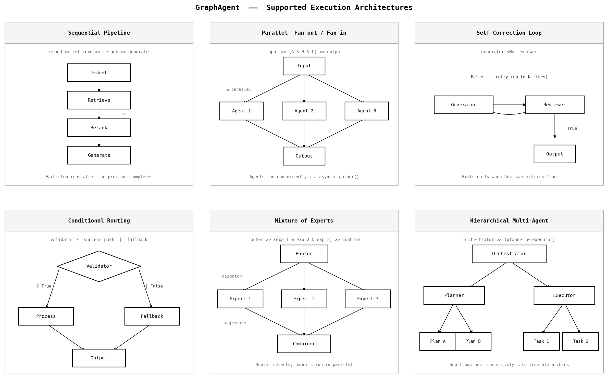

# GraphAgent

[](https://github.com/ayushi-agarwall/tinyagent/releases)
[](https://www.python.org/downloads/)
[](https://opensource.org/licenses/MIT)
[](./src/tinyagent/core.py)
[](./pyproject.toml)

A zero-dependency, async-first agent orchestration framework built on graph theory.



## Overview

GraphAgent is a minimal, production-ready framework for building AI agents and complex multi-agent orchestrations. The entire core is under 100 lines of Python using only the standard library.

| Framework | Core Lines | Dependencies | Vendor Lock-in |
|-----------|------------|--------------|----------------|
| LangGraph | ~15,000+ | 20+ | LangChain ecosystem |
| CrewAI | ~8,000+ | 30+ | CrewAI platform |
| Pydantic AI | ~5,000+ | 15+ | Pydantic ecosystem |
| AutoGen | ~20,000+ | 40+ | Microsoft Azure |
| GraphAgent | ~120 | 0 | None |

## Key Features

- **Zero bloat**: No unnecessary abstractions
- **Zero dependencies**: Python standard library only
- **Zero vendor lock-in**: Integrate with any LLM, tool, or service
- **Native Context Graphs**: Agent state transitions form a traversable graph, providing structured data for advanced debugging and future GNN-based optimization
- **True Parallel Execution**: Uses `asyncio.gather()` for concurrent node execution
- **Expression Caching**: Parses DSL once, reuses compiled execution plan
- **Bounded Tracing**: Automatic memory management with configurable trace limits
- **Input Validation**: Catches errors before execution (missing nodes, invalid syntax, circular flows)
- **Production Ready**: Async-safe state, proper error handling, timeout/retry support

## Core Concepts

GraphAgent is built on three primitives:

| Component | Purpose |
|-----------|---------|
| `Node` | Atomic unit of work (agent) |
| `State` | Thread-safe, transient data container with timestamped tracing |
| `Flow` | Graph orchestrator with DSL parser |

### Edge Operators

```
>>    Sequential: Run A then B
&     Parallel: Run A and B concurrently (true parallelism via asyncio.gather)
?     Conditional Success: Run B only if A succeeds
|     Conditional Failure: Run B only if A fails
<N>   Loop: Alternate between A and B up to N times, return last result
()    Grouping: Isolate precedence
```

## Installation

### Option 1: Install from Source

```bash
git clone https://github.com/ayushi-agarwall/tinyagent.git
cd tinyagent
pip install -e .
```

### Option 2: Copy-Paste (Zero Install)

```bash
curl -O https://raw.githubusercontent.com/ayushi-agarwall/tinyagent/main/src/tinyagent/core.py
```

### Option 3: PyPI (Coming Soon)

```bash
pip install tinyagent
```

## Quick Start

```python
import asyncio
from tinyagent import Node, State, Flow

# Define nodes directly (no decorator needed)
async def fetch_data(state: State) -> bool:
    await state.set("data", {"value": 42})
    return True

async def process_data(state: State) -> bool:
    data = await state.get("data")
    await state.set("result", data["value"] * 2)
    return True

# Register nodes
fetch = Node("fetch", fetch_data)
process = Node("process", process_data)

async def main():
    # Create state with trace_id for tracking
    state = State(trace_id="my-workflow-001")
    
    # Run flow
    flow = Flow()
    await flow.run("fetch >> process", state)
    
    print(await state.get("result"))  # 84
    print(state.trace)  # [(timestamp, 'fetch:OK:0.001s', None), ...]

asyncio.run(main())
```

## Supported Architectures

TinyAgent's graph-based execution model natively supports:

### Multi-Agent Systems
Parallel execution with fan-out and fan-in. Multiple specialized agents work concurrently on subtasks.

### Workflow Automation
Sequential pipelines with conditional branching. Tasks execute in order with success/failure routing.

### RAG Pipelines
Retrieval-augmented generation through sequential composition: embedding, retrieval, reranking, generation.

### Graph of Thoughts (GoT)
Parallel reasoning branches that explore multiple solution paths simultaneously.

### Mixture of Experts (MoE)
Router nodes dispatch to specialized expert nodes running in parallel, with a combiner for final output.

### Self-Correction Loop (Reflexion)
Bidirectional loops using `<N>`. Generator produces output, validator checks it, loop continues until success or max iterations.

```python
# Example: Self-correction with max 3 attempts
await flow.run("generator <3> validator", state)
```

### Hierarchical Multi-Agent
Nested flows where orchestrator nodes invoke sub-flows, enabling tree-structured agent hierarchies.

## Native Context Graphs

TinyAgent treats agent state transitions as a traversable graph. Each trace entry captures:
- **Timestamp**: When the node executed
- **Event**: Node name, status (OK/TIMEOUT/ERR), duration
- **Metadata**: Optional custom data

This structured format provides:
1. **Advanced Debugging**: Visualize execution paths, identify bottlenecks
2. **Performance Analysis**: Track node durations, detect anomalies
3. **GNN Training Data**: Trace graphs can train Graph Neural Networks for self-optimizing flows

```python
state = State(trace_id="workflow-123", max_trace=1000)
await flow.run("A >> (B & C) >> D", state)

# Trace forms a graph: A -> B, A -> C, B -> D, C -> D
for timestamp, event, metadata in state.trace:
    print(f"{timestamp}: {event}")
```

## API Reference

### State

```python
State(
    data: dict[str, Any] | None = None,  # Initial state data
    async_safe: bool = False,             # Enable async lock for concurrent access
    trace_id: str | None = None,          # Custom trace identifier
    max_trace: int = 1000                 # Maximum trace entries (bounded deque)
)
```

**Methods:**
- `await state.get(key, default=None)` - Retrieve value
- `await state.set(key, value)` - Store value
- `state.log(entry, metadata=None)` - Add custom trace entry
- `state.trace` - Deque of (timestamp, event, metadata) tuples
- `state.trace_id` - Unique trace identifier

### Node

```python
Node(
    name: str,                                    # Unique node identifier
    fn: Callable[[State], Awaitable[bool]],      # Async function
    timeout: float | None = None,                # Execution timeout (must be > 0)
    retries: int = 0                             # Retry count (must be >= 0)
)
```

**Validation:**
- Raises `ValueError` if timeout <= 0
- Raises `ValueError` if retries < 0
- Auto-registers in global registry

### Flow

```python
Flow()
```

**Methods:**
- `await flow.run(expr: str, state: State) -> bool` - Execute DSL expression

**Features:**
- Expression caching: Parses once, reuses compiled plan
- Validation: Checks for missing nodes, unmatched parentheses
- Error handling: Clear error messages with available nodes listed

## Loop Operator

The `<N>` operator alternates execution between two nodes:

```python
await flow.run("generator <3> reviewer", state)
```

**Execution:**
1. Run generator
2. Run reviewer
3. If reviewer returns `True`, exit (success)
4. Otherwise, repeat up to N times
5. Return last reviewer result

**Use Case:** Self-correction loops where generator produces output and reviewer validates it.

## Parallel Execution

The `&` operator uses `asyncio.gather()` for true parallelism:

```python
import time

async def api_call_1(state: State) -> bool:
    await asyncio.sleep(0.3)
    return True

async def api_call_2(state: State) -> bool:
    await asyncio.sleep(0.3)
    return True

Node("api1", api_call_1)
Node("api2", api_call_2)

start = time.time()
await Flow().run("api1 & api2", state)
elapsed = time.time() - start

# elapsed ≈ 0.3s (parallel), not 0.6s (sequential)
```

## Conditional Operators

**`?` (Conditional Success):**
```python
await flow.run("validate ? process", state)
# Runs process ONLY if validate returns True
```

**`|` (Conditional Failure):**
```python
await flow.run("risky_task | fallback", state)
# Runs fallback ONLY if risky_task returns False
# Returns risky_task result if it succeeds
```

## Error Handling

```python
try:
    await flow.run("nonexistent_node", state)
except ValueError as e:
    print(e)  # "Node 'nonexistent_node' not found in registry. Available: [...]"

try:
    await flow.run("((unmatched", state)
except ValueError as e:
    print(e)  # "Unmatched opening parenthesis in expression"
```

## Future Roadmap

### GNN-Powered Self-Optimization

TinyAgent trace logs are architected as timestamped graph data specifically designed to serve as training data for Graph Neural Networks (GNNs/GCNs). This enables:

1. **Execution Pattern Learning**: GNNs learn optimal execution paths from historical traces
2. **Temporal Modeling**: Timestamps enable State Space Models on temporal graphs
3. **Predictive Routing**: Dynamic edge weight optimization based on node performance
4. **Anomaly Detection**: Identification of suboptimal or failing flow patterns
5. **Self-Healing Flows**: Automatic rerouting around predicted failure points

The native context graph structure (trace as adjacency list) directly maps to GNN input format.

### Planned Features

- Workflow visualization (Mermaid diagrams from trace)
- OpenTelemetry integration
- Pub/sub event system
- Global agent registry

## License

MIT License. See [LICENSE](./LICENSE) for details.
